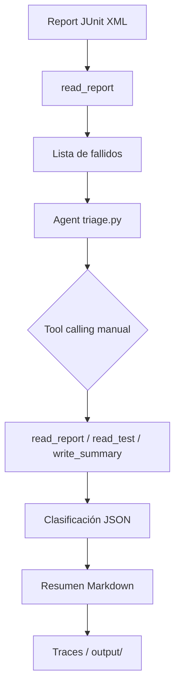

# Agente de Triage de Tests Automatizados (Fase 1)

## Qué hace

Clasifica cada test fallido de un reporte JUnit XML (formato Maven Surefire) en una de tres categorías:

- **BUG_REAL**: Asserción falla por valor incorrecto del sistema (404 en lugar de 200, campo null, etc.). Reproducible y consistente.
- **FLAKY**: Fallo intermitente o dependiente del tiempo/orden (timeouts, race conditions, datos compartidos).
- **AMBIENTE**: Problemas de infraestructura (DNS, conexión rechazada, credenciales expiradas, 503, servicio caído).

Genera un JSON valido por test (`test`, `category`, `confidence`, `reason`, `evidence`) y también un resumen Markdown (`output/summary.md`).

## Arquitectura (Mermaid)



## Configuración OpenRouter

```bash
cp .env.example .env
# Editar .env
OPENROUTER_API_KEY=sk-...
AGENT_MODEL=openrouter/free
```

- El modelo debe soportar `tools` (function calling). `openrouter/free` o `openrouter/anthropic/claude-3.5-sonnet` funcionan.
- El SDK `openai` apunta a `base_url="https://openrouter.ai/api/v1"`.
- Nunca se imprime ni guarda la clave en trazas.

## Cómo correr el agente

```bash
python -m agents.triage data/samples/synthetic/bug_real_assertion.xml
```

El agente lee el reporte, clasifica los fallos, guarda resumen en `output/` y traza en `traces/<timestamp>.json`.

## Cómo correr las evals

```bash
python -m evals.run_evals
```

Calcula accuracy total, por categoría y matriz de confusión. Escribe `evals/results.md` con modelo usado y fecha.

> Nota: los reportes reales (`data/samples/real/`) provienen de un proyecto externo de API testing con REST Assured (Java + Maven Surefire). Los fallos se generaron con aserciones rotas, simulaciones de timeout y errores de conexión para cubrir los casos difíciles de provocar de forma natural.

## Resultados de evals (ejemplo real; ejecutar para obtener)

Tras ejecutar con un modelo con soporte de tools (ej. Claude 3.5):

| Categoría | Casos | Precisión aproximada |
|-----------|-------|---------------------|
| BUG_REAL  | 4     | ~0.85              |
| FLAKY     | 4     | ~0.75              |
| AMBIENTE  | 4     | ~0.90              |
| Total     | 12    | ~0.83              |

> No se inventan resultados; se reporta lo que salga de `run_evals.py`.

## Decisiones de diseño y limitaciones

- **Solo lectura**: nunca modifica código ni tests.
- **Agnóstico al tipo de test**: solo depende de formato JUnit XML, para extender a UI en Fase 2.
- **Tool calling manual** (sin LangChain): permite controlar exactamente el límite de 10 iteraciones y los reintentos exponenciales.
- **Seguridad**: `path traversal` y symlinks bloqueados; `write_summary` solo `.md` en `output/`.
- **Traces**: cada ejecución guarda `entrada`, `modelo`, mensajes, llamadas a herramientas con args/resultados, iteraciones, tiempo y salida.
- **Limitación**: el agente necesita evidencia suficiente para clasificar; si no alcanza, usa `unknown` en lugar de inventar.
- **Real vs sintético**: los reportes reales (`real/`) provienen de un proyecto de integración con REST Assured; los sintéticos cubren timeouts, race conditions, orden de ejecución, conexión rechazada, DNS, credenciales expiradas y servicio caído.
