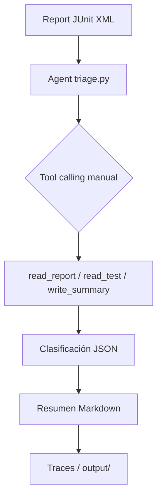

# Agente de Triage de Tests Automatizados (Fase 1)

## Qué hace

Clasifica cada test fallido de un reporte JUnit XML (formato Maven Surefire) en una de cuatro categorías:

- **BUG_REAL**
- **FLAKY**
- **AMBIENTE**
- **UNKNOWN** (evidencia insuficiente o varias explicaciones plausibles)

- **BUG_REAL**: Aserción falla por valor incorrecto del sistema (404 en lugar de 200, campo null, etc.). Reproducible y consistente.
- **FLAKY**: Fallo intermitente o dependiente del tiempo/orden (timeouts, race conditions, datos compartidos).
- **AMBIENTE**: Problemas de infraestructura (DNS, conexión rechazada, credenciales expiradas, 503, servicio caído).

Genera un JSON estructurado por test (`test_name`, `category`, `confidence`, `reason`, `evidence` como lista) sin estructura duplicada `unknown`; `UNKNOWN` es una categoría válida dentro de `results`.

## Arquitectura (Mermaid)



## Configuración OpenRouter

```bash
cp .env.example .env
# Editar .env
OPENROUTER_API_KEY=sk-...
# Elige un modelo con soporte de tools en https://openrouter.ai/models y fija un ID concreto; openrouter/free rota de modelo y vuelve las evals no reproducibles
AGENT_MODEL=<id-de-modelo-con-soporte-de-tools>
```

- El modelo debe soportar `tools` (function calling). Elige un ID concreto en https://openrouter.ai/models; `openrouter/free` rota de modelo y vuelve las evals no reproducibles.
- El SDK `openai` apunta a `base_url="https://openrouter.ai/api/v1"`.
- Nunca se imprime ni guarda la clave en trazas.

## Cómo correr el agente

```bash
python -m agents.triage data/samples/synthetic/bug_real_assertion.xml
```

El agente lee el reporte, clasifica los fallos, guarda resumen en `output/` y traza en `traces/<timestamp>.json`.

## Cómo correr las evals

```bash
python -m evals.run_evals
```

Calcula accuracy total, por categoría y matriz de confusión. Escribe `evals/results.md` con modelo usado y fecha.

> Nota sobre `data/samples/real/`: la carpeta existe; cada XML se generó con REST Assured (Java + Maven Surefire) a partir de un proyecto externo de API testing, simulando fallos reales (aserções rotas, timeouts, errores de conexión, servicios caídos). Actualmente no contiene archivos; agregar reportes reales del proyecto externo cuando estén disponibles.

## Resultados de evals

Ejecutar para obtener resultados reales (no inventados):

```bash
python -m evals.run_evals
```

Esto escribe `evals/results.md` con accuracy total, por categoría y comparación Triage vs Baseline, indicando el modelo usado y la fecha. El archivo `evals/results.md` debe copiarse a esta sección tras ejecutar `python -m evals.run_evals`, incluyendo siempre el baseline real (aunque sea bajo) sin inventar cifras.

## Decisiones de diseño y limitaciones

- **Solo lectura**: nunca modifica código ni tests.
- **Agnóstico al tipo de test**: solo depende de formato JUnit XML, para extender a UI en Fase 2.
- **Tool calling manual** (sin LangChain): permite controlar exactamente el límite de 10 iteraciones y los reintentos exponenciales.
- **Seguridad**: `path traversal` y symlinks bloqueados; `write_summary` solo `.md` en `output/`.
- **Traces**: cada ejecución guarda `entrada`, `modelo`, mensajes, llamadas a herramientas con args/resultados, iteraciones, tiempo y salida.
- **Limitación**: el agente necesita evidencia suficiente para clasificar; si no alcanza, usa `unknown` en lugar de inventar.
- **Real vs sintético**: los reportes reales (`real/`) provienen de un proyecto de integración con REST Assured; los sintéticos cubren timeouts, race conditions, orden de ejecución, conexión rechazada, DNS, credenciales expiradas y servicio caído.

## Baseline vs LLM

El baseline (`agents/baseline.py`) es un clasificador de reglas fijas (excepción + mensaje) que sirve como punto de comparación objetivo. Se evalúa siempre, sin depender de la API, y su accuracy real se reporta en `evals/results.md`. El LLM (`triage.py`) debe superar o al menos acercarse al baseline; si hay errores de ejecución o falta de datos, se marca como "No calculado" con el motivo, sin ocultar el baseline ni inventar cifras.
